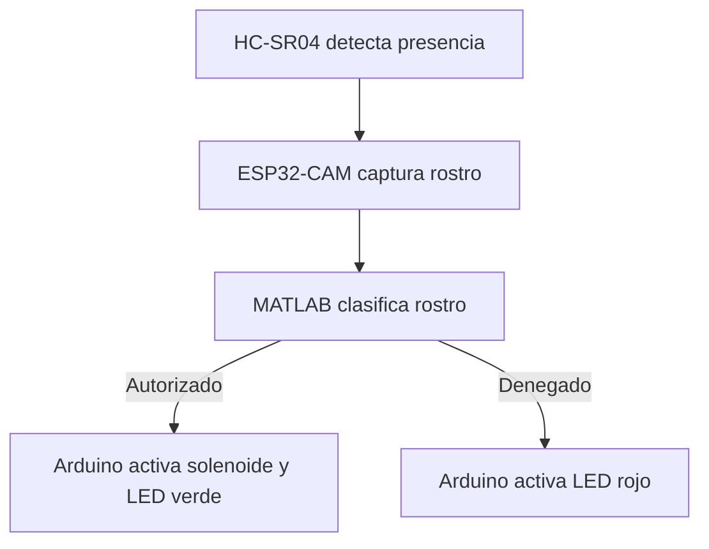
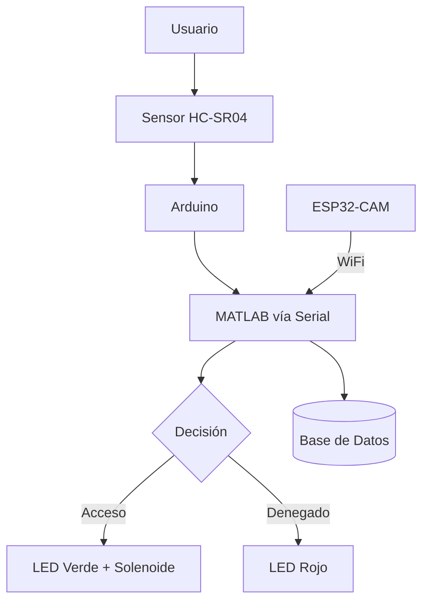

# Proyecto-Final-ABET
FaceGuard - Access Control System with Face Recognition
# 🔐 Sistema de Seguridad con Reconocimiento Facial para Caja Fuerte

Este proyecto implementa un sistema de seguridad basado en reconocimiento facial utilizando visión artificial y control físico mediante Arduino. El sistema detecta la presencia de una persona mediante un sensor ultrasónico, captura su imagen con una ESP32-CAM, realiza el reconocimiento facial usando redes neuronales en MATLAB, y actúa sobre una cerradura solenoide en función del resultado del reconocimiento.

## 🔧 Requisitos
- **Hardware**:
  - Arduino Uno
  - ESP32-CAM
  - Sensor ultrasónico HC-SR04
  - Cerradura solenoide 12V
  - LEDs (rojo y verde)
- **Software**:
  - MATLAB R2020b+ (con Toolboxes de Visión Artificial)
  - Arduino IDE

## 🚀 Instalación
1. **Cargar firmware en Arduino**:
   - Abre `security_system.ino` en Arduino IDE.
   - Selecciona la placa "Arduino Uno" y puerto COM correcto.
   - Sube el código.

2. **Configurar ESP32-CAM**:
   - Usa el firmware AI-Thinker para streaming HTTP.
   - Configura WiFi en `config.h`:
     ```cpp
     const char* ssid = "TU_RED";
     const char* password = "TU_CONTRASEÑA";
     ```

3. **Ejecutar en MATLAB**:
   - Abre `facial_recognition_system.m`.
   - Ajusta `esp32_ip` según la IP asignada al ESP32.
   - Ejecuta el script (requiere conexión serial a Arduino).

## 📌 Notas
- La cerradura solenoide requiere fuente externa de 12V.
- Para mejor precisión, captura la imagen de referencia con buena iluminación.

---

## 1. 📡 Selección de Sensores y Actuadores

### 🔍 Parámetros Físicos a Medir:
- **Distancia**: Para activar el sistema al detectar presencia humana.
- **Imagen facial**: Captura para reconocimiento de identidad.

### 🔧 Acciones a Realizar:
- Activación de cerradura (apertura/cierre).
- Encendido de LEDs (indicadores de acceso).
- Captura y envío de imagen.

### 📈 Sensores:

| Sensor            | Parámetro           | Rango         | Precisión     | Salida        |
|------------------|---------------------|---------------|---------------|---------------|
| HC-SR04          | Distancia           | 2 cm – 400 cm | ~3 mm         | PWM (tiempo)  |
| ESP32-CAM        | Imagen facial       | —             | VGA/SVGA      | TCP/IP (HTTP) |

### ⚙️ Actuadores:

| Actuador         | Tipo          | Parámetro           | Voltaje | Corriente | Función                   |
|------------------|---------------|----------------------|---------|-----------|---------------------------|
| Solenoide 12V    | Electromecánico | Fuerza lineal        | 12V     | ~1A       | Abrir/Cerrar cerradura   |
| LEDs (Rojo/Verde)| Óptico        | Estado de acceso     | 5V      | <20mA     | Indicación visual        |

---

## 2. ⚡ Cálculo Eléctrico y Mecánico

### 🔋 Voltaje y Corriente:
- **Fuente principal**: 12V DC con reguladores para derivar 5V (Arduino y LEDs) y 3.3V (ESP32).
- **Solenoide**: 12V @ 1A → requiere fuente externa separada con control mediante relé o MOSFET.
- **ESP32-CAM**: 3.3V @ ~160mA (requiere regulador estable).
- **Arduino UNO**: Alimentación por USB o 5V regulados.

### 🧮 Cálculo de Fuerza:
- **Fuerza de retención del solenoide**: Mínimo 2 kgf (~20 N).
- Se elige un modelo con 10–15 N para garantizar apertura segura.

> 🛡️ Se consideran márgenes de seguridad del 25% para cargas imprevistas.

---

## 3. 🧠 Memoria y Gestión de Datos

### 💾 Requisitos de Memoria:
- **Muestras por segundo**: 1 cada 5 segundos (cuando hay alguien cerca).
- **Formato**: Imágenes JPG (640x480), etiquetas de texto (`autorizado`, `denegado`).

### 📊 Tipos de Datos:
- **Imágenes**: `uint8` RGB (3 canales por pixel).
- **Resultados de clasificación**: `string` o `enum`.
- **Tiempos y fechas**: `datetime` (para registro de logs).

### 🧠 Entrenamiento de Datos:
- **Red neuronal entrenada en MATLAB** (con Transfer Learning).
- **Dataset local**: ~50 imágenes por usuario.
- **Entrenamiento offline**: Modelo preentrenado cargado en MATLAB.

> 🚫 No se requiere transmisión a la nube → bajo consumo de ancho de banda.

---

## 4. 🗃️ Base de Datos y Almacenamiento

### 💽 Sistema de Almacenamiento:
- **Tipo**: Local (archivos en disco) con posibilidad de escalar a SQLite o MongoDB.
- **Velocidad requerida**: baja → procesamiento local suficiente.
- **Persistencia**: Historial de accesos almacenado como log.

### 📁 Esquema de Guardado:
- Carpeta `dataset/usuarioX/`: Imágenes faciales por usuario.
- Archivo `log_accesos.csv`: Registra hora, imagen y resultado.

```csv
Fecha,Hora,Usuario,Resultado
2025-04-24,10:32:15,usuario1,Autorizado
2025-04-24,10:36:02,Desconocido,Denegado
```
### 📸 Vista General del Funcionamiento:

## 🔍 Visualizaciones Adicionales

### Diagrama de Flujo del Sistema


### ✅ Control de Arduino (Cerradura, LEDs y Sensor Ultrasónico)
```cpp
#include <Servo.h>

#define trigPin 9
#define echoPin 8
#define ledVerde 4
#define ledRojo 5
#define cerradura 6

void setup() {
  pinMode(trigPin, OUTPUT);
  pinMode(echoPin, INPUT);
  pinMode(ledVerde, OUTPUT);
  pinMode(ledRojo, OUTPUT);
  pinMode(cerradura, OUTPUT);
  Serial.begin(9600);
}

void loop() {
  long duration;
  digitalWrite(trigPin, LOW); delayMicroseconds(2);
  digitalWrite(trigPin, HIGH); delayMicroseconds(10);
  digitalWrite(trigPin, LOW);
  duration = pulseIn(echoPin, HIGH);
  float distance = duration * 0.034 / 2;

  if (distance < 30) {
    if (Serial.available()) {
      char cmd = Serial.read();
      if (cmd == 'A') {
        digitalWrite(cerradura, HIGH);
        digitalWrite(ledVerde, HIGH);
        digitalWrite(ledRojo, LOW);
        delay(5000); // mantener abierta 5 seg
        digitalWrite(cerradura, LOW);
        digitalWrite(ledVerde, LOW);
      } else if (cmd == 'D') {
        digitalWrite(ledRojo, HIGH);
        delay(2000);
        digitalWrite(ledRojo, LOW);
      }
    }
  }
}

```

---

### 📷 Captura de imágenes:
```matlab
cam = webcam('ESP32-CAM');
outputFolder = 'dataset/usuario1';
mkdir(outputFolder);

for i = 1:50
    img = snapshot(cam);
    filename = fullfile(outputFolder, sprintf('rostro_%d.jpg', i));
    imwrite(img, filename);
    pause(0.2);
end
```
### 🧠 Entrenamiento de Red Neuronal en MATLAB:
```matlab
imds = imageDatastore('dataset', ...
    'IncludeSubfolders', true, ...
    'LabelSource', 'foldernames');

[trainImgs, testImgs] = splitEachLabel(imds, 0.8);

net = alexnet;
layers = net.Layers;
layers(end-2) = fullyConnectedLayer(2); % acceso / denegado
layers(end) = classificationLayer;

options = trainingOptions('sgdm', ...
    'InitialLearnRate', 1e-4, ...
    'MaxEpochs', 5, ...
    'MiniBatchSize', 10);

trainedNet = trainNetwork(trainImgs, layers, options);
```
### 📷 Detección en Tiempo Real desde ESP32-CAM:
```matlab
img = snapshot(cam); % desde ESP32
label = classify(trainedNet, img);

if label == "autorizado"
    % Enviar señal al Arduino para abrir cerradura
    disp("Acceso permitido");
    writeline(arduinoSerial, 'A'); % 'A' = abrir
else
    % Enviar señal de denegado
    disp("Acceso denegado");
    writeline(arduinoSerial, 'D'); % 'D' = denegar
end

```
---

## 🧱 Arquitectura de la Red Neuronal

### 🔁 Esquema Detallado:

- **Entrada:** Imagen RGB de tamaño `[224 x 224 x 3]`
- **Capa Base:** `resnet18` preentrenada
- **Capa de Clasificación:**
  - `fullyConnectedLayer(2)` (autorizado/no autorizado)
  - `softmaxLayer`
  - `classificationLayer`

### 🔍 Justificación de Componentes:

- `resnet18`: proporciona un buen balance entre precisión y velocidad para dispositivos embebidos.
- `fullyConnectedLayer`: ajustada al número de clases específicas del problema.
- `softmax`: convierte las salidas en probabilidades.
- `classificationLayer`: calcula la pérdida en clasificación supervisada.

---

## 🗂️ Descripción de la Base de Datos

- **Nombre:** Capturas propias (usuario1)
- **Origen:** Capturado con ESP32-CAM
- **Estructura:**
  - ~50 imágenes por usuario
  - Formato JPEG (`224x224`, RGB)
  - Atributos: clase (autorizado/no autorizado)

---
